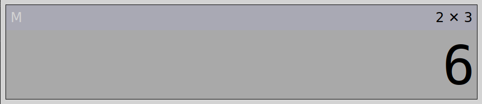
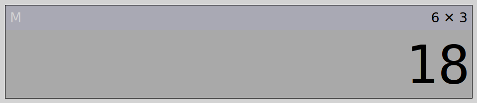
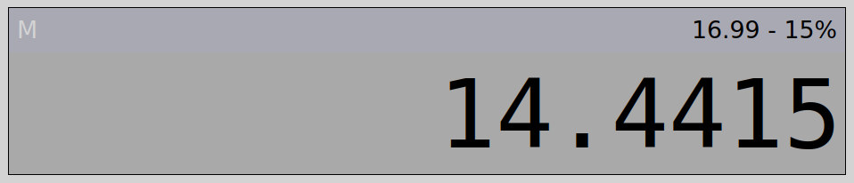

# Calculator
## About
This webpage was created as part of my work for the FNB App Academy program. This is a basic calculator made to learn, practice and demonstrate my JavaScript skills, but also includes HTML and CSS.

## Special features
### Clear
When you make a mistake or want to abort the current calculation, you can use the `C` and `AC` buttons. Press `C` to clear the display, but keep the current calculation. Press `AC` to clear everything and return to the initial state.

### Repeat
When you have done a calculation, you may press the `=` key to perform the same operation again on the result. For example, to multiply by 3 repeatedly: 

1. Input `2` `✕` `3` `=`.

2. Press `=` again. The calculator will multiply the result, 6, by 3 again.

3. You can keep pressing `=` to multiply the last result by 3, yielding 54, 162, 486, and so on.

### Percentage
You can add or subtract percentages of numbers using the percentage operator. For example, subtracting 15% of 16.99 gives 14.4415. This can be calculated as: `1` `6` `.` `9` `9` `-` `1` `5` `%`.

### Memory
A number can be saved to memory to be reused at a later time. Only one number can be stored at a time. Use `M+` to store a number, or to add to the number already in memory, `MR` to recall the stored number for using in calculations, and MC to clear the memory. The 'M' in the top-left corner turns green when a number is saved, and is white if there is no number in memory.

### Keyboard input
If you're using a physical keyboard, you can type instead of pressing onscreen keys. These are the set key bindings.

|Function		|Key						|
|---			|---						|
|Digits 0 - 9	|Numpad digit keys 0 - 9	|
|Decimal point	|`.`						|
|Add			|Numpad `+`					|
|Subtract		|`-` (Numpad or number row)	|
|Multiply		|Numpad `*`					|
|Divide			|`/` or numpad `/`        	|
|Clear			|`c`						|
|Add to memory	|Hold `m`, then press `+`	|
|Recall memory	|Hold `m`, then press `r`	|
|Clear memory	|Hold `m`, then press `c`	|
|Result			|`↵`						|

Additionally, keyboard users can use the `Backspace` key (not available on the onscreen keyboard) to remove one digit from the input.

# Attribution
This project uses the "fitty" JS module by Rik Schennink.