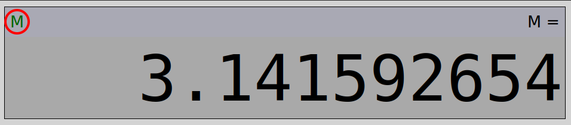

# Calculator
## About
This webpage was created as part of my work for the FNB App Academy program. This is a basic calculator meant to learn, practice and demonstrate my JavaScript skills, but also includes basic HTML and CSS.
## Basic operation
To do a calculation, enter the first number, then an operation (+, -, ✕, ÷), then the second number. For example, this is how 1 + 2 is calculated:

1. Initially, the display looks like this.

2. Press `1`.

3. Press `+`.

4. Press `2`.

5. Press `=`. The result is displayed on screen.

## Special features
### Repeat
When you have done a calculation, you may press the `=` key to perform the same operation again on the result. For example, here's how to multiply by 3 repeatedly:

1. Input `2` `✕` `3` `=`.

2. Press `=` again. The calculator will multiply the result, 6, by 3 again.

3. You can keep pressing `=` to multiply the last result by 3.

### Percentage
#### Mode 1
Pressing the `%` key before starting a calculation divides the number by 100. For example, typing `3` then `%` will result in `0.03`. (Press `C` first to ensure that a calculation is not in progress)
#### Mode 2
You can add and subtract percentages of numbers by typing the first number, then a basic operation, then the percentage to multiply the first number by, then `=`. For example, subtracting 15% of 16.99 gives 14.4415. This can be calculated as follows:
1. Input `1` `6` `.` `9` `9` `-` `15` `%`

### Memory
A number can be saved to memory to be reused at a later time. 
#### Add to memory
Let's save the number `3.141592654` (the value of pi).
Input `3` `.` `1` `4` `1` `5` `9` `2` `6` `5` `4`, then press `M+`.

Note that the "M" status light turns green, to indicate that a non-zero value is stored in memory.

Press `M+` again, to add that number to memory again:

#### Recall from memory
To use the saved value in a calculation, press `MR`.
For example, to calculate the circumference of a circle with radius 5 m, multiply it by 2π, whose value is saved in memory. This is done as follows:
1. Input `5` `✕`, then press `MR`. The top of the display will briefly show `M = `.

It will then change to show the calculation in progress.

2. Press `=`. The result, 31.41592654 m, is the circumference.

#### Clear memory
When you have a number, saved in memory, press `MC` to clear it. The "M" status light turns gray to indicate the absence of a value.

### Keyboard input
If you're using a physical keyboard, you can type instead of pressing onscreen keys. These are the set key bindings.

|Function		|Key						|
|---			|---						|
|Digits 0 - 9	|Numpad digit keys 0 - 9	|
|Decimal point	|`.`						|
|Add			|Numpad `+`					|
|Subtract		|`-` (Numpad or number row)	|
|Multiply		|Numpad `*`					|
|Divide			|`/`, numpad `/` or `\`		|
|Clear			|`c`						|
|Add to memory	|Hold `m`, then press `+`	|
|Recall memory	|Hold `m`, then press `r`	|
|Clear memory	|Hold `m`, then press `c`	|
|Result			|`↪`						|